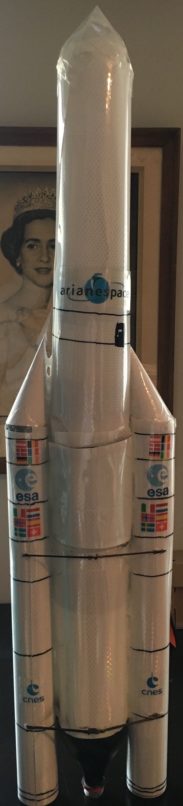

# Ariane V

This are the decals you can use for an Ariane V model. Based on WikiMedia sources, edited by Haroen Viaene.

Made for a water pressure rocket for JWR in 2015-2016. First launched on 13 November 2016.

# Files

1. Source files for the flags
2. Edited ESA, CNES and Arianespace logo
3. .sketch, .pdf and .svg of the assembly
4. A mirrored .pdf at A4 scale for a rocket of 115 cm (approx)

Can be printed on paper or on transparency

# License

this is licensed under a [Creative Commons Attribution-NonCommercial-ShareAlike 4.0 International License](http://creativecommons.org/licenses/by-nc-sa/4.0/). No warranty whatsoever.
